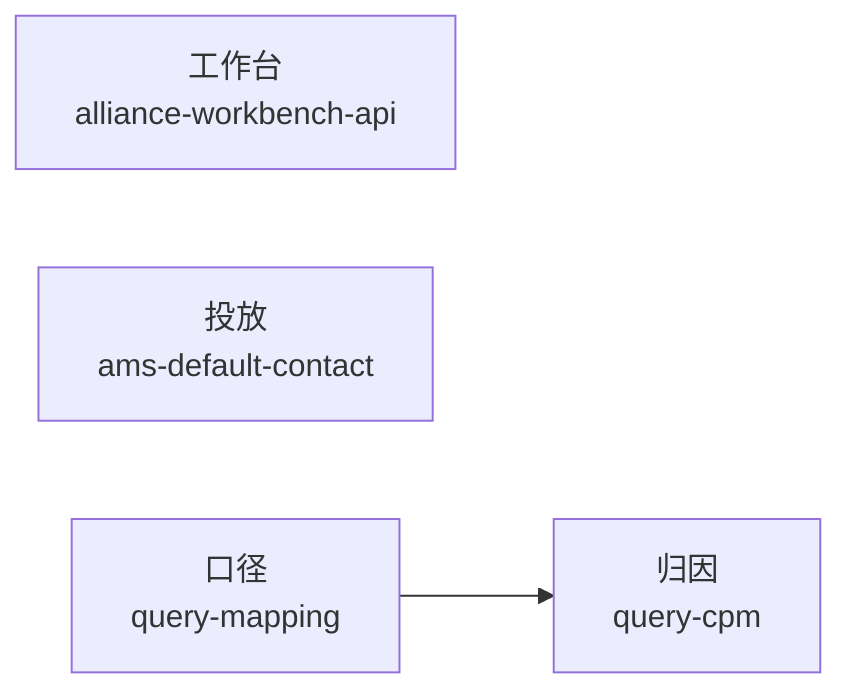

# SKILLS

运营能力以独立包存在于此。装哪一个、用哪一套契约，由场景决定——不是一份大而全的工具箱。

凭证、Cookie、跑批结果只留本机。



---

## 工作台

本机联盟诊断工作台。Agent 只打 `127.0.0.1:3000`，由服务端代理上游；真实域名不进本仓库。

**[alliance-workbench-api](./skills/alliance-workbench-api/)**  
策略查询、审核编排、延期托管、游戏定投、定向屏蔽、KwaiBI 查数。DataAgent 是旁路；效果监控仍是壳。

[SKILL](./skills/alliance-workbench-api/SKILL.md) · [HTTP 契约](./skills/alliance-workbench-api/API.md) · [实现源](https://github.com/UUOquinn/alliance-advertiser-funnel-web/blob/main/docs/API.md)

---

## 投放

腾讯 DSP 服务商后台。批量改账户联系人走接口，不走开户页逐条点选。

**[ams-default-contact](./skills/ams-default-contact/)**  
对应「账户联系人 / 默认联系人」。默认 `advertiser/update`；`--bind-only` 才用 `bind_link_person`。不做「新增联系人」短信链路。

[SKILL](./skills/ams-default-contact/SKILL.md) · [API](./skills/ams-default-contact/API.md) · [脚本](./skills/ams-default-contact/scripts/bind-contact.js)

```bash
cd skills/ams-default-contact/scripts
cp api.example.json api.json    # 本机填写，勿提交
node bind-contact.js --dry-run
```

---

## 取数

先定口径，再拆指标。两包顺序使用，不要跳过 mapping 直接写字段名。

**[query-mapping](./skills/query-mapping/)**  
时间、流量主、广告主、广告场景、转化目标 → 字段与数据集。默认离线 `85587`；仅「当天实时」才用 `129496`。

[SKILL](./skills/query-mapping/SKILL.md)

**[query-cpm](./skills/query-cpm/)**  
媒体反馈 CPM 变差时：预算结构、场景占比、同场景 CTR / CVR。对比对象与时间窗口问清再查。

[SKILL](./skills/query-cpm/SKILL.md)

---

## 安装

每个包是 `skills/<name>/` 下的完整项目，可单独链接：

```bash
git clone https://github.com/UUOquinn/SKILLS.git
cd SKILLS
ln -s "$(pwd)/skills/<name>" ~/.cursor/skills/<name>
```

机器索引：[catalog.json](./catalog.json)。新增包：[CONTRIBUTING.md](./CONTRIBUTING.md)。

Issue 与 PR 中不要出现真实 Cookie、执照号或 uid 跑批名单。
