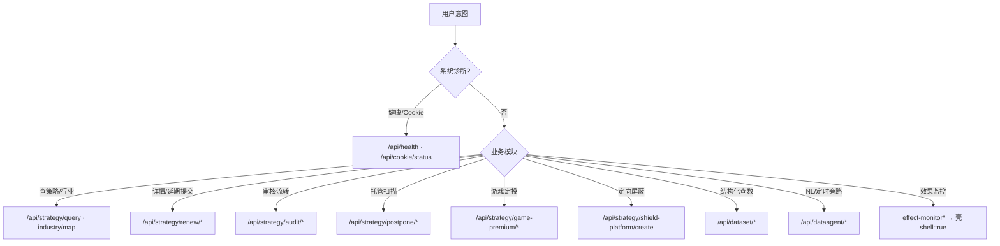

# 联盟诊断工作台 · API Skill

本机工作台（`http://127.0.0.1:3000`）的 **Agent 调用契约**：浏览器 / Agent 只打本机 `/api/*`，由服务端 Playwright / Cookie 代理上游。上游真实域名不在本 Skill 内。

| 原则 | 说明 |
|------|------|
| 本机入口 | Base：`http://127.0.0.1:3000`（或部署机局域网 `:3000`） |
| 无用户 Bearer | Orient 类接口由服务端会话代理；不要 invent Token |
| 看包络不看 HTTP | 上游业务失败常仍 HTTP 200 → 以 `success` / `error` 为准 |
| 凭证不上聊天 | Cookie 走本机服务或请求头，禁止粘贴完整 Cookie |
| 全文契约 | [API.md](API.md) |

**上游实现源：** [alliance-advertiser-funnel-web/docs/API.md](https://github.com/UUOquinn/alliance-advertiser-funnel-web/blob/main/docs/API.md)

## 何时启用

- 调工作台「查 / 审 / 延 / 定投 / 屏蔽 / 查数」接口
- 排查 `COOKIE_EXPIRED`、`SSO_RECOVERING`、`ORIENT_FAILED`、`STRATEGY_NOT_FOUND`
- 写 curl / 脚本对接 `:3000/api/*`
- 区分 DataAgent 旁路 vs Orient 主路径、效果监控壳 vs 真实能力

## 模块路由（先选模块再查字段）



| 模块 | 代表路径 | 说明 |
|------|----------|------|
| 系统 | `GET /api/health` | Playwright / SSO 态 |
| 日志 | `GET/POST /api/workbench/logs` | 本机运行日志 |
| 策略查询 | `POST /api/strategy/query` | 开发者 / 广告位 / 应用 ID |
| 详情·延期 | `POST /api/strategy/renew/get` · `submit` | 详情探测多 prefix |
| 审核 | `POST /api/strategy/audit/flow` · `batchPass` | 状态机 + 自动审 |
| 延期托管 | `GET/POST /api/strategy/postpone/*` | 需 `X-Postpone-Operator` |
| 游戏定投 | `POST /api/strategy/game-premium/*` | 媒体拉数 + 创建 |
| 定向屏蔽 | `POST /api/strategy/shield-platform/create` | type=7 `batchAddV2` |
| KwaiBI | `POST /api/dataset/query` | 离线 `85587` / 实时 `129496` |
| DataAgent | `/api/dataagent/*` | **旁路**，前端默认主路径不依赖 |
| 效果监控 | `/api/strategy/effect-monitor*` | **占位壳**，勿当真实监控 |

## Agent 调用清单

1. **先读** [API.md](API.md) 对应章节（索引表 → 字段）。
2. POST 必须 `Content-Type: application/json`；触发类接口也要非空 body（如 `{}`）。
3. 解析响应：`success === true` 再读 `data`；否则读 `error` / `message`。
4. `401 COOKIE_EXPIRED` → 提示服务端重新登录，不要改打上游域名。
5. `503 SSO_RECOVERING` → 稍后重试。
6. 效果监控接口返回 `shell: true` 时如实告知「功能未开放」，不要编造成功业务结果。
7. 示例 ID（策略 id、creatorId 等）仅为文档占位，用用户给定值替换。

## 响应包络（统一）

```json
{ "success": true,  "data": { } }
{ "success": false, "error": "ERROR_CODE", "message": "可读说明" }
```

| HTTP | error | 含义 |
|------|-------|------|
| 400 | （文案） | 参数缺失 / 非法 / 空 body |
| 401 | `COOKIE_EXPIRED` | 会话失效 |
| 403 | `FORBIDDEN` | 延期托管无编辑权限 |
| 404 | `NOT_FOUND` 等 | 路径或资源不存在 |
| 502 | （文案） | 上游代理失败 |
| 503 | `SSO_RECOVERING` | SSO 自愈中 |

## 常用请求头

| 头 | 场景 |
|----|------|
| `Content-Type: application/json` | 几乎所有 POST |
| `X-Postpone-Operator` | 延期托管写操作 / 日志操作人 |
| `X-Kwabi-Cookie` | KwaiBI 查数（可选覆盖） |
| `X-DataAgent-Cookie` | DataAgent 旁路（可选覆盖） |

## 快速自检

```bash
curl -sS http://127.0.0.1:3000/api/health | python3 -m json.tool
```

更多 curl 与字段级说明 → **[API.md](API.md)**。

## 边界

- **做：** 本机工作台 HTTP 面的正确调用、错误码解读、模块选型。
- **不做：** 直连上游运营/数据平台真实域名；替代工作台 UI 产品决策；把效果监控壳当成已上线能力。
- **不含脚本：** 本包为契约 Skill；可执行批处理见其它包（如 `ams-default-contact`）。
